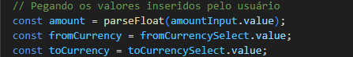

## Descrição Geral do Projeto  
Objetivo: Esse projeto vai permitir que os usuários insiram um valor em uma moeda e recebam o valor convertido em outra moeda, usando taxas de câmbio definidas diretamente no código.  

Tecnologias a serem utilizadas:  
HTML5: Para estruturar a página da aplicação, criando formulários e elementos visuais.  
CSS3: Para estilizar a página, tornando-a visualmente atraente e fácil de usar.  
JavaScript (puro): Para implementar a lógica de conversão de moedas, permitindo que a aplicação funcione interativamente.
   
## Constante exchangeRates
Aqui, estamos declarando uma constante chamada exchangeRates, que armazena as taxas de câmbio entre diferentes moedas.  
O uso da palavra-chave const significa que a variável não pode ser reatribuída, ou seja, as taxas de câmbio são fixas.  
2. Estrutura de Dados:  
A estrutura usada é um objeto JavaScript. Cada chave desse objeto representa uma moeda (USD, BRL, EUR).
Cada moeda tem um valor associado que é outro objeto, contendo as taxas de câmbio em relação a outras moedas.
3. Exemplos de Taxas de Câmbio:   
USD (Dólar Americano):  
Para 1 USD, você recebe 5.30 BRL (Reais) e 0.85 EUR (Euros).  
BRL (Real Brasileiro):  
Para 1 BRL, você recebe 0.19 USD e 0.16 EUR.  
EUR (Euro):  
Para 1 EUR, você recebe 1.18 USD e 6.20 BRL.  
## Resumo:
Esse código define uma tabela de conversão de moedas, onde cada moeda tem suas respectivas taxas de câmbio em relação a outras moedas. Essa estrutura é útil para realizar a conversão de valores na aplicação web, permitindo que o JavaScript acesse rapidamente as taxas de câmbio necessárias para calcular o valor convertido quando o usuário faz uma solicitação.  

   

## vamos analisar a função convertCurrency

1. Definição da Função:  
A função convertCurrency é responsável por realizar a conversão de um valor monetário de uma moeda para outra.  
Ela aceita três parâmetros:  
amount: o valor a ser convertido.  
fromCurrency: a moeda de origem.  
toCurrency: a moeda de destino.   

2. Condição de Conversão Direta:  

Se as moedas forem diferentes, a função realiza o cálculo da conversão.  
Aqui, o valor (amount) é multiplicado pela taxa de câmbio correspondente, que é acessada através do objeto exchangeRates.  
exchangeRates[fromCurrency][toCurrency] obtém a taxa de câmbio do valor em fromCurrency para toCurrency.    

## Resumo:
A função convertCurrency é uma implementação simples para converter valores entre diferentes moedas. Ela verifica se não há necessidade de conversão (quando as moedas são iguais) e, em caso contrário, utiliza a taxa de câmbio pré-definida para calcular e retornar o valor convertido. Essa lógica é fundamental para a funcionalidade da aplicação de conversão de moedas.    

   

## Elementos dos dom

1. Referências ao DOM  
Este trecho de código utiliza document.getElementById() para selecionar elementos do DOM (Document Object Model) da página HTML. Isso permite que você manipule esses elementos através do JavaScript.
2. Elementos Selecionados  
form: Este elemento é uma referência ao formulário que provavelmente contém os campos para a entrada de dados (como o valor e as seleções de moeda). Ele é identificado pelo ID currency-form.  

amountInput: Esta constante armazena uma referência ao campo onde o usuário insere o valor a ser convertido. O campo é identificado pelo ID amount.  

fromCurrencySelect: Esta constante refere-se ao elemento de seleção (dropdown) onde o usuário escolhe a moeda de origem. O elemento é identificado pelo ID from-currency.  

toCurrencySelect: Semelhante ao anterior, esta constante armazena a referência ao elemento de seleção para a moeda de destino, identificado pelo ID to-currency.  

resultDisplay: Esta constante é uma referência ao elemento onde o resultado da conversão será exibido, identificado pelo ID conversion-result.  

## Resumo:
Essas referências são fundamentais para interagir com os elementos da interface do usuário. Com elas, você pode obter valores inseridos pelo usuário, manipular as seleções de moedas e exibir os resultados da conversão na página. Este código é uma parte essencial para a funcionalidade da aplicação de conversão de moedas, permitindo que o JavaScript interaja com o HTML de forma dinâmica.

## evento de submissão do formulário.

1. Adicionando um Evento ao Formulário  
O método addEventListener é utilizado para registrar um "ouvinte de eventos" no elemento form.  
Neste caso, estamos escutando o evento submit, que ocorre quando o usuário tenta enviar o formulário.  
2. Função de Callback  
A função que segue o function(event) é chamada sempre que o evento submit é disparado. Essa função recebe um parâmetro event, que representa o evento que ocorreu.  

3. Prevenindo o Comportamento Padrão    

A chamada a event.preventDefault() impede o comportamento padrão do formulário, que normalmente seria recarregar a página ou redirecionar para outra página ao ser enviado.  
Isso é importante em aplicações JavaScript, pois queremos lidar com a submissão do formulário de forma programática, em vez de deixar o navegador gerenciar isso.  
## Resumo:
Esse trecho de código é fundamental para controlar o envio do formulário na aplicação de conversão de moedas.  Ao prevenir o comportamento padrão, você pode coletar os dados inseridos pelo usuário, realizar a conversão utilizando a lógica implementada e, em seguida, exibir o resultado na mesma página, sem recarregar.  

## código que coleta os valores inseridos pelo usuário.  

1. Capturando o Valor Monetário:  

Aqui, estamos acessando o valor inserido pelo usuário no campo amountInput.  
O método value retorna uma string com o conteúdo do campo de entrada.  
parseFloat() é utilizado para converter essa string em um número de ponto flutuante (decimal). Isso é importante para garantir que possamos realizar cálculos com o valor inserido.  

2. Capturando a Moeda de Origem:

Esta linha captura o valor selecionado no dropdown de moedas de origem (fromCurrencySelect).  
O value retorna o valor da moeda selecionada (por exemplo, "USD", "BRL", "EUR").    

3. Capturando a Moeda de Destino:
Semelhante à linha anterior, aqui estamos capturando o valor da moeda de destino a partir do dropdown (toCurrencySelect).

## Resumo:
Este código é responsável por coletar as informações que o usuário insere na interface da aplicação de conversão de moedas. Ele obtém o valor a ser convertido e as moedas de origem e destino, preparando essas informações para que a conversão possa ser realizada em etapas subsequentes do código. A conversão do valor para um tipo numérico é crucial para realizar cálculos posteriormente.

## valida o valor inserido pelo usuário.

1. Validação do Valor
isNaN(amount): Esta função verifica se o valor de amount é "Not-a-Number" (não é um número). Se o usuário não inserir um valor válido que possa ser convertido para número, essa função retornará true.
amount <= 0: Essa condição verifica se o valor inserido é menor ou igual a zero. Valores negativos ou zero não são válidos para conversão de moedas.
2. Mensagem de Erro:
resultDisplay.textContent = 'Por favor, insira um valor válido.';
Se qualquer uma das condições de validação for verdadeira, uma mensagem de erro é exibida no elemento resultDisplay. Isso informa ao usuário que o valor inserido não é válido e que ele deve inserir um valor correto.
3. Interrompendo a Execução

  A instrução return é usada para sair da função imediatamente, evitando que o código abaixo (que realizaria a conversão) seja executado.
## Resumo:
Esse trecho de código é crucial para garantir que a aplicação funcione corretamente. Ele valida a entrada do usuário, garantindo que um número positivo seja fornecido para a conversão de moedas. Se a entrada não for válida, uma mensagem apropriada é exibida, e a execução do código é interrompida, evitando erros ou resultados inesperados.

## calcula a conversão de moedas.

1. Chamando a Função de Conversão:  
Aqui, a função convertCurrency é chamada com três argumentos:  
amount: o valor que o usuário inseriu e que deve ser convertido.  
fromCurrency: a moeda de origem selecionada pelo usuário.  
toCurrency: a moeda de destino para a qual o valor deve ser convertido.  
2. Armazenando o Resultado:
O resultado da função convertCurrency é armazenado na constante convertedAmount.  
Essa constante agora contém o valor convertido, que pode ser um número em relação à moeda de destino.  
## Resumo:
Esse trecho é fundamental para a lógica da aplicação de conversão de moedas. Ele utiliza a função previamente definida para calcular o valor convertido com base na entrada do usuário e nas moedas selecionadas. O resultado é então armazenado para ser usado posteriormente, como na exibição ao usuário. Essa linha é um passo crucial na execução da funcionalidade de conversão.

## resultado da conversão de moedas.

1. Formatando o Resultado:  
${amount.toFixed(2)}: Esta parte formata o valor original (amount) para ter duas casas decimais. O método toFixed(2) converte o número para uma string, representando o valor com duas casas decimais (por exemplo, 10.50).

${convertedAmount.toFixed(2)}: Similarmente, esta parte formata o valor convertido (convertedAmount) para também ter duas casas decimais.

2. Construindo a Mensagem:  
A string interpolada (utilizando as crases `\) combina os valores formatados e as moedas em uma única mensagem.
O resultado final pode ser algo como: "10.50 USD = 8.50 EUR".
3. Atualizando o DOM:  
A propriedade textContent do elemento resultDisplay é atualizada com a mensagem formatada. Isso exibe o resultado da conversão na interface do usuário.
## Resumo:
Este trecho é responsável por apresentar o resultado da conversão de forma clara e formatada. Ele garante que os valores monetários sejam exibidos com duas casas decimais e que a mensagem seja compreensível para o usuário, mostrando tanto o valor original quanto o convertido, juntamente com as moedas correspondentes. Essa etapa finaliza o processo de conversão, tornando os resultados visíveis para quem está utilizando a aplicação.

    

## o evento de reset do formulário.

1. Adicionando um Evento de Reset:  
O método addEventListener é usado novamente, mas desta vez para escutar o evento reset, que ocorre quando o usuário clica em um botão para redefinir o formulário.  
2. Função de Callback:  
A função que segue o function() é chamada quando o evento de reset é disparado. Ela não recebe parâmetros, pois o evento reset não fornece informações adicionais que sejam necessárias neste caso.  

3. Limpando o Resultado:  
Esta linha redefine o conteúdo do elemento resultDisplay para uma string vazia. Isso remove qualquer resultado anterior que foi exibido quando o formulário foi enviado.  
## Resumo:
Este trecho de código é responsável por garantir que, ao redefinir o formulário, o resultado da conversão seja limpo da interface do usuário. Isso melhora a experiência do usuário, garantindo que não haja confusão entre resultados anteriores e novos dados que possam ser inseridos após um reset. É uma boa prática em formulários interativos, ajudando a manter a interface clara e organizada.  

As informações que compartilhei são baseadas em conceitos comuns de JavaScript, HTML e CSS, que são amplamente documentados em várias fontes confiáveis. Aqui estão algumas referências que você pode consultar para aprofundar seu entendimento:

MDN Web Docs (Mozilla Developer Network):

https://developer.mozilla.org/pt-BR/docs/Web/JavaScript  
https://developer.mozilla.org/pt-BR/docs/Web/API/Document_Object_Model  
https://developer.mozilla.org/pt-BR/docs/Web/HTML/Element  
https://developer.mozilla.org/pt-BR/docs/Web/CSS  

Essas fontes oferecem tutoriais, exemplos e uma boa base teórica sobre os conceitos usados na aplicação de conversão de moedas. 

Este projeto foi produzido por:   
https://github.com/biacosta0  
https://github.com/HelenaJardimm 